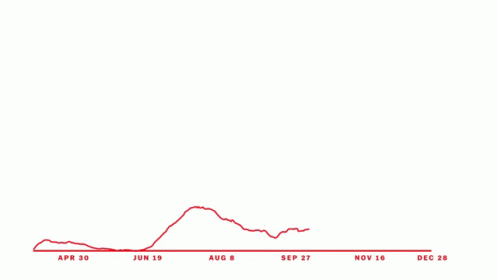
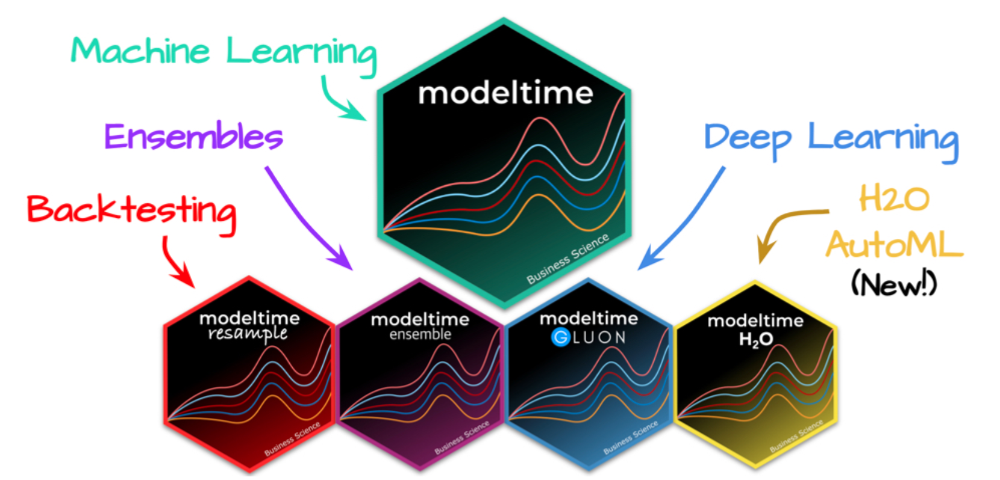
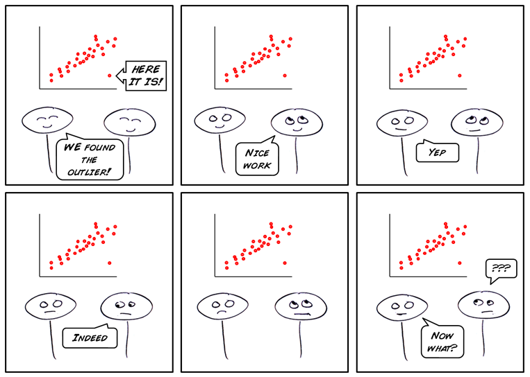
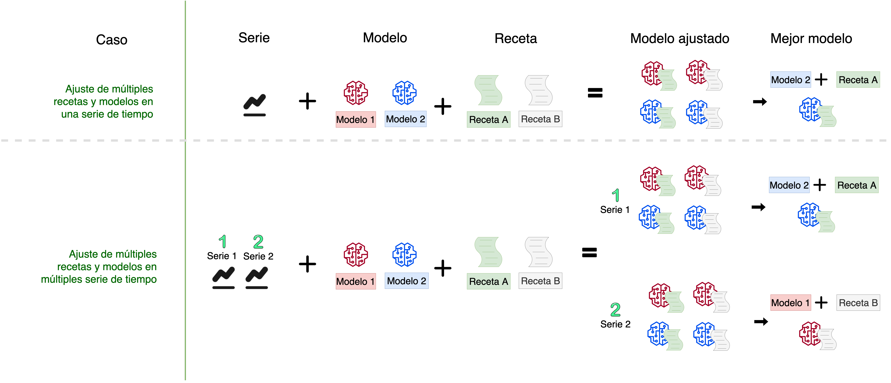

class: center

```{r, out.width='40%', echo=FALSE}

```
# Sknifedatar


**Ajuste y visualización de múltiples modelos**

**sobre múltiples series de tiempo**


```{r, echo=FALSE, out.width='10%', out.height='10%', fig.align='center'}

```

<br>

Rafael Zambrano & Karina Bartolomé

2021-10-06


---

```{r setup, include=FALSE}
knitr::opts_chunk$set(warning = FALSE, 
                      message = FALSE, 
                      comment=FALSE)
```

```{r xaringan-themer, include=FALSE, warning=FALSE, eval=FALSE}
# Para generar el .css pero igual ya está generado, no correr de vuelta y editar el archivo directamente 
library(xaringanthemer)
style_mono_accent(
  title_slide_background_color	='#ffffff',
  title_slide_text_color = '#33407d',
  base_color = "#33407d",
  header_font_google = google_font("Josefin Sans"),
  text_font_google   = google_font("Montserrat", "300", "300i"),
  code_font_google   = google_font("Fira Mono")
)
```

```{css, echo=FALSE}
/* Table width = 100% max-width */
.remark-slide table{width: 100%;}
/* Change the background color to white for shaded rows (even rows) */
.remark-slide thead, .remark-slide tr:nth-child(2n) {
  background-color: white;
  .tfoot .td {background-color: white}
}
.bold-last-item > ul > li:last-of-type,
.bold-last-item > ol > li:last-of-type {font-weight: bold;}
```


```{r, include=FALSE, warning=FALSE}
xaringanExtra::use_progress_bar(color = "#0051BA", location = "top")
```

# ¿Quiénes somos?
.pull-left[
### Rafael Zambrano
- Actuario 🇻🇪
- Data Scientist en Ualá 🚀
- Magister en métodos cuantitativos (en curso)
]
.pull-right[
<br>
<br>
```{r, out.width='35%', fig.align='center', echo=FALSE}

```
]

.pull-left[
### Karina Bartolomé
- Economista 🇦🇷
- Data Scientist en Ualá 🚀
- Especialista en métodos cuantitativos (en curso)
]
.pull-right[
<br>
<br>
```{r, out.width='35%', fig.align='center', echo=FALSE}

```
]
---
# ¿Qué es #modeltime?

Es un ecosistema desarrollado por **Matt Dancho** para realizar análisis de series de tiempo mediante un enfoque ordenado (o Tidy) con #tidymodels 📦. 

```{r, echo=FALSE, out.height='90%',out.width='90%',  fig.align='center'}

```

---

# Sknifedatar 📦
#### Una extensión de **{modeltime}**
```{r, eval=FALSE}
install.packages('sknifedatar')
```
--
```{r, echo=FALSE, out.width='15%', out.height='15%', fig.align='center'}
knitr::include_graphics('images/sknifedatar.png')
```

Incluye: 
- **Funciones multifit**: Múltiples modelos en múltiples series de tiempo (sin datos de panel)
- **Workflowsets**: Ajuste de múltiples modelos y recetas de preprocesamiento con modeltime
- **Workflowset multifit**: Ajuste de múltiples modelos y recetas de preprocesamiento sobre múltiples modelos (sin datos de panel)
- **Automagic tabs**: Generación automática de tabs
---
# ¿Qué vamos a ver hoy?

```{r, echo=FALSE, out.width='30%', fig.align='center'}
knitr::include_graphics('images/gif_gato_lentes.gif')
```

- **Introducción a modeltime**

- **Multifit**: Ajuste de múltiples modelos en múltiples series de tiempo

- **Workflowsets**: Ajuste de múltiples modelos y recetas de preprocesamiento sobre múltiples modelos

- **Automagic tabs**: Generación automática de tabs en Distill / Rmd

---

# Librerías utilizadas 📚

```{r, message=FALSE}
library(sknifedatar)
library(modeltime)
library(workflowsets)
library(tidymodels)
library(tidyverse)
library(timetk)
library(anomalize) 
library(lubridate)
```

```{r, echo=FALSE}
library(gt)
```


```{r, echo=FALSE, out.width='50%', fig.align='center'}
knitr::include_graphics('images/gif_libros.gif')
```

```{r, echo=FALSE}
xaringanExtra::use_panelset()
```

---

# Datos 📊

Se utilizan datos de [Competencia de Kaggle: M5 Forecasting 2020](https://www.kaggle.com/c/m5-forecasting-accuracy/data?select=sales_train_evaluation.csv)

--
```{r}
data <- read_rds('data/series_data.rds')
```
--
```{r, echo=FALSE}
data %>% head(5) %>% kableExtra::kable(format = "html")
```

---

### Evolución 📈

```{r, fig.width=10, fig.height=5, message=FALSE, eval=FALSE}
data %>% group_by(dept_id) %>%
  plot_time_series(date, value) 
```

```{r, fig.width=10, fig.height=6, message=FALSE, echo=FALSE}
data %>% group_by(dept_id) %>%
  plot_time_series(date, value, .interactive=FALSE,
    .facet_ncol = 2, .facet_scales = 'free_y') 
```

---


### Descomposición de series de tiempo 

.panelset[
.panel[.panel-name[FOODS_2]

```{r, message=FALSE, echo=FALSE, fig.width=10, fig.height=6}
nest_data <- data %>% nest(nested_column = -dept_id)
nest_plots <- nest_data %>%
  mutate(ts_plots = map(nested_column, 
          ~  plot_stl_diagnostics(.x, 
              .date_var=date, 
              .value=value, 
              .frequency = 'auto',
              .trend = 'auto', 
              .interactive=FALSE,
              .feature_set = c("observed", "season", "trend", "remainder"))
          ))
nest_plots$ts_plots[[1]]
```
]

.panel[.panel-name[FOODS_3]

```{r, echo=FALSE, fig.width=10, fig.height=6}
nest_plots$ts_plots[[2]]
```
]

.panel[.panel-name[HOBBIES_2]

```{r, echo=FALSE, fig.width=10, fig.height=6}
nest_plots$ts_plots[[3]]
```
]

.panel[.panel-name[HOUSEHOLD_1]

```{r, echo=FALSE, fig.width=10, fig.height=6}
nest_plots$ts_plots[[4]]
```
]
]
---
### Descomposición de series de tiempo: último año

.panelset[
.panel[.panel-name[FOODS_2]

```{r, message=FALSE, echo=FALSE, fig.width=10, fig.height=6}
nest_data <- data %>% 
  filter(date>as.Date('2016-01-01')) %>% 
  nest(nested_column = -dept_id)
nest_plots <- nest_data %>%
  mutate(ts_plots = map(nested_column, 
          ~  plot_stl_diagnostics(.x, 
              .date_var=date, 
              .value=value, 
              .frequency = 'auto',
              .trend = 'auto', 
              .interactive=FALSE,
              .feature_set = c("observed", "season", "trend", "remainder"))
          ))
nest_plots$ts_plots[[1]]
```
]

.panel[.panel-name[FOODS_3]

```{r, echo=FALSE, fig.width=10, fig.height=6}
nest_plots$ts_plots[[2]]
```
]

.panel[.panel-name[HOBBIES_2]

```{r, echo=FALSE, fig.width=10, fig.height=6}
nest_plots$ts_plots[[3]]
```
]

.panel[.panel-name[HOUSEHOLD_1]

```{r, echo=FALSE, fig.width=10, fig.height=6}
nest_plots$ts_plots[[4]]
```
]
]

---
### Detección de anomalías 🔍

```{r, fig.width=10, fig.height=5, message=FALSE, eval=FALSE}
data %>% group_by(dept_id) %>%
  plot_anomaly_diagnostics(date, value) 
```

```{r, fig.width=10, fig.height=6, message=FALSE, echo=FALSE}
data %>% group_by(dept_id) %>%
  plot_anomaly_diagnostics(date, value, .anom_size = 2, .interactive=FALSE,
    .facet_ncol = 2, .max_anomalies = 0.05, .facet_scales = 'free_y', .line_size=0.1) 
```

---
<br>
<br>
```{r, echo=FALSE, out.height='75%', out.width='75%', fig.align='center'}

```

---
### Limpieza de anomalías

```{r}
data_cleaned <- data %>%
  
  group_by(dept_id) %>% 
  
  time_decompose(value) %>%
  
  mutate(observed = ifelse(observed < 0, 0, observed)) %>%
  
  anomalize(remainder) %>%
  
  clean_anomalies() %>% 
  
  ungroup() 
```

```{r, echo=FALSE}
data_cleaned %>% 
  filter(anomaly == "Yes", dept_id=='FOODS_3') %>%
  select(dept_id, date, anomaly, observed, observed_cleaned) %>%
  gt()
```


---

Se seleccionan las variables relevantes: 

```{r}
data_cleaned <- data_cleaned %>% 
  select(dept_id, date, value = observed_cleaned)
```

Graficando nuevamente las series, se observa que ya no se mantienen observaciones atípicas:

```{r, fig.width=10, fig.height=6, message=FALSE, echo=FALSE}
data_cleaned %>% group_by(dept_id) %>%
  plot_time_series(date, value, .interactive=FALSE,
    .facet_ncol = 2, .facet_scales = 'free_y', .line_size=0.5) 
```

---

<br>
<br>
# Múltiples modelos y una serie 
<br>
```{r, out.width='25%', fig.align='center', echo=FALSE}
knitr::include_graphics('images/gif_gatos_multi.gif')
```


---
## Flujo de trabajo de modeltime 

### Preparación de datos ⚙️

* Se selecciona el departamento **FOODS_3** 

```{r, fig.height=3, fig.width=10}
data_foods3 <- data_cleaned %>% 
  filter(dept_id=='FOODS_3') %>% 
  select(-dept_id)
```

--
* Se particiona el dataset en train y test ✂️

```{r, fig.height=3, fig.width=10}
splits <- data_foods3 %>%  
  initial_time_split(prop = 0.7)
```

---
### Visualización de la partición 

```{r, fig.height=6, fig.width=10}
splits %>% 
  tk_time_series_cv_plan() %>%
  plot_time_series_cv_plan(date, value, 
                           .title='Partición temporal') 
```

---
### Receta 🧁
Se crea una receta de **preprocesamiento**, incluye la fórmula a estimar y un paso adicional que añade variables en función de la fecha.
```{r}
receta <- recipe(value ~ date, data = training(splits)) %>%
  
  step_timeseries_signature(date) %>% 
  
  step_rm(contains("iso"), 
          contains("minute"), 
          contains("hour"),
          contains("am.pm"), 
          contains("xts"), 
          contains("second"),
          date_index.num, 
          date_wday.lbl, 
          date_month.lbl)
```

```{r, echo=FALSE}
receta %>% prep() %>% juice() %>% head(2) %>% gt()
```

---
### Modelos 🚀
Definición y ajuste de modelos sobre train

```{r, eval=FALSE}
# Modelo: Auto-ARIMA
m_autoarima <- arima_reg() %>% 
  set_engine('auto_arima') %>%  
  fit(value~date, data=training(splits))

# Modelo: regresión lineal
m_reg_lineal <- linear_reg() %>%
  set_engine("lm") %>%
  fit(value ~ as.numeric(date) + 
              factor(month(date, label = TRUE), ordered = FALSE)+
              factor(wday(date, label=TRUE), ordered=FALSE),
      data = training(splits))

# Workflow: prophet boosted
m_prophet_boost <- workflow() %>% 
  add_recipe(receta) %>% 
  add_model(
    prophet_boost(mode='regression') %>%
    set_engine("prophet_xgboost")
  ) %>% 
  fit(data = training(splits))
```

---
### Modeltimetable 

El objeto central del ecosistema **{modeltime}** 📦 es el **modeltime_table**, el cual incluye todos los modelos entrenados para realizar comparaciones. 

```{r, eval=FALSE}
modelos <- modeltime_table(m_autoarima,
                           m_reg_lineal,
                           m_prophet_boost
                           )
```

```{r, echo=FALSE}
#saveRDS(modelos, 'modelos/modelos_food3.rds')
modelos <- readRDS('modelos/modelos_food3.rds')
```

--
```{r, echo=FALSE}
modelos %>% rmarkdown::paged_table(list(rows.print = 6))
```

---
### Calibración de modelos ⚙️
Se verifica el **rendimiento** de los modelos sobre la partición de test.

```{r}
calibration_table  <- modelos %>% 
  modeltime_calibrate(new_data = testing(splits))
```

--
* Verificación de métricas 🎯
```{r, eval=FALSE}
calibration_table %>% 
  modeltime_accuracy()
```

```{r, echo=FALSE}
calibration_table %>% modeltime_accuracy() %>% 
  select(-.type) %>% 
  rmarkdown::paged_table(list(rows.print = 6))
```

---
* Forecasting 🔬

Se realiza la **proyección** sobre los datos de testing para luego visualizarla. 

```{r}
forecast_series <- calibration_table %>% 
  modeltime_forecast(
    new_data    = testing(splits),
    actual_data = data_foods3)
```

---

### Verificación visual

```{r, fig.height=5, fig.width=10}
forecast_series %>% 
  plot_modeltime_forecast(
    .legend_max_width     = 30, 
    .interactive          = TRUE,
    .conf_interval_alpha  = 0.2
  )
```

---
### Selección y reajuste de modelos

Se selecciona el mejor modelo, que en este caso fue el Prophet with xgboost errors. Luego se reajustan ambos modelos en todos los datos (train + test)

```{r}
refit_tbl <- calibration_table %>%
  filter(.model_id %in% c(3)) %>% 
  modeltime_refit(data = data_foods3)
```

---

## Proyección 🔮

```{r}
forecast_final <- refit_tbl %>% 
  modeltime_forecast(
    actual_data = data_foods3 %>% as.data.frame(),
    h='6 months'
  )
```

---

### Visualización de la proyección a 2 años
```{r, fig.height=5, fig.width=10}
forecast_final %>% 
  plot_modeltime_forecast(
    .legend_max_width = 30, 
    .interactive      = FALSE,
    .conf_interval_alpha = 0.2
)
```

---


# Workflowsets en múltiples series 

```{r, fig.align='center', echo=FALSE}

```


---

```{r}
nest_data <- data_cleaned %>% nest(nested_column = -dept_id)
```

```{r, echo=FALSE, out.height='10%'}
reactable::reactable(nest_data, details = function(index) {
  data <- data[data$dept_id == nest_data$dept_id[index], c('date','value')] %>% 
    mutate(value = round(value, 2))
  htmltools::div(style = "padding: 10px", reactable::reactable(data, outlined = TRUE))
}, defaultPageSize=4) 
```

---

### Recetas 🧁
```{r}
# Receta base
recipe_base <- recipe(value~date, data=data_cleaned)

# Características según fecha
recipe_date_extrafeatures <- recipe_base %>% 
  step_date(date, 
            features = c('week', 'month','year','quarter','semester'))

# Resagos
recipe_date_extrafeatures_lag <- recipe_date_extrafeatures %>% 
  step_lag(value, lag = 7)
```

```{r, echo=FALSE}
recipe_date_extrafeatures_lag %>% prep() %>% juice() %>% head(2) %>% gt()
```

---

Se imputan los valores faltantes en la variable resagada: 

```{r}
recipe_date_extrafeatures_lag <- recipe_date_extrafeatures_lag %>% 
  step_ts_impute(all_numeric(), period=365)
```

```{r, echo=FALSE}
recipe_date_extrafeatures_lag %>% prep() %>% juice() %>% head(2) %>% gt()
```

---
### Modelos 🚀

```{r}
# prophet_xgboost
prophet_boost <- prophet_boost(mode = 'regression') %>% 
  set_engine("prophet_xgboost")

#auto_arima_xgboost
auto_arima_boost <- arima_boost() %>% 
  set_engine('auto_arima_xgboost')
# tbats
tbats <-seasonal_reg() %>% 
  set_engine("tbats")
```

---


### Workflowsets ✨

```{r}
wfsets <- workflow_set(
  preproc = list(
    base                  = recipe_base,
    extrafeatures         = recipe_date_extrafeatures,
    extrafeatures_lag     = recipe_date_extrafeatures_lag
  ),
  models  = list(
    M_arima_boost       = auto_arima_boost,
    M_prophet_boost     = prophet_boost,
    M_tbats             = tbats
  ),
  cross   = TRUE
) 
```

---
👉 El objeto **wfsets** contiene todas las posibles combinaciones de recetas con modelos: 

```{r}
wfsets %>% 
  rmarkdown::paged_table(list(rows.print = 6))
```

---

### Ajuste de modelos ⚙️ 
```{r, eval=FALSE}
wfs_multifit <- modeltime_wfs_multifit(serie = nest_data,
                                       .prop = 0.7,
                                       .wfs  = wfsets)
```

```{r, echo=FALSE}
#saveRDS(wfs_multifit, 'modelos/wfs_multifit.rds')
wfs_multifit <- readRDS('modelos/wfs_multifit.rds')
```

```{r, echo=FALSE}
wfs_multifit$table_time %>% 
  rmarkdown::paged_table(list(rows.print = 6))
```

---
**Performance según MAE de cada modelo en cada serie**

Se utiliza la función **modeltime_wfs_heatmap()** de **{sknifedatar}** 📦 para visualizar la performance de cada workflow. 

.panelset[
.panel[.panel-name[FOODS_2]

```{r, message=FALSE, echo=FALSE, fig.width=10, fig.height=5}
plots <- wfs_multifit$models_accuracy %>% 
  select(-.model_id) %>%  
  rename(.model_id=.model_names) %>% mutate(.fit_model = '') %>% 
  group_by(name_serie) %>% 
  nest() %>% 
  mutate(plot = map(data, ~ modeltime_wfs_heatmap(., metric = 'mae',
                                                 low_color = '#ece2f0',
                                                 high_color = '#1f356e'
                                                 ))) %>% 
  ungroup()
plots$plot[[1]]
```
]

.panel[.panel-name[FOODS_3]

```{r, echo=FALSE, fig.width=10, fig.height=5}
plots$plot[[2]]
```
]

.panel[.panel-name[HOBBIES_2]

```{r, echo=FALSE, fig.width=10, fig.height=5}
plots$plot[[3]]
```
]

.panel[.panel-name[HOUSEHOLD_1]

```{r, echo=FALSE, fig.width=10, fig.height=5}
plots$plot[[4]]
```
]
]
---
### Proyecciones 🔬
```{r, message=FALSE, warning=FALSE}
wfs_multiforecast <- modeltime_wfs_multiforecast(
  wfs_multifit$table_time, .prop=0.7)
```

```{r, echo=FALSE, fig.height=6, fig.width=14, fig.align='center'}
wfs_multiforecast %>% 
  select(dept_id, nested_forecast) %>% 
  unnest(nested_forecast) %>% 
  group_by(dept_id) %>% 
  plot_modeltime_forecast(
    .legend_max_width = 40,
    .facet_ncol = 2, 
    .line_size = 0.5,
    .interactive = FALSE,
    .facet_scales = 'free_y',
    .title='Proyecciones') +
  theme(legend.position='bottom', legend.margin=margin())
```

---
### Selección del mejor modelo 🥇
```{r}
wfs_bests<- modeltime_wfs_multibestmodel(
  .table = wfs_multiforecast,
  .metric = "mae",
  .minimize = TRUE
)
```

### Reentrenamiento para todos los datos 🌀

```{r, eval=FALSE, message=FALSE, warning=FALSE, comment=FALSE}
wfs_refit <- modeltime_wfs_multirefit(wfs_bests)
```

```{r, echo=FALSE}
#saveRDS(wfs_refit, 'modelos/wfs_refit.rds')
wfs_refit <- readRDS('modelos/wfs_refit.rds')
```

---
### Proyecciones a 6 meses 🔮

```{r, message=FALSE, warning=FALSE, comment=FALSE}
wfs_forecast <- modeltime_wfs_multiforecast(wfs_refit, 
                                            .h = "6 month")
```

```{r, echo=FALSE, fig.width=10, fig.height=6}
wfs_forecast %>% 
  select(dept_id, nested_forecast) %>% 
  unnest(nested_forecast) %>% 
  group_by(dept_id) %>% 
  plot_modeltime_forecast(
    .facet_ncol = 2, 
    .line_size = 0.5,
    .legend_max_width = 50,
    .interactive = FALSE,
    .facet_scales = 'free_y',
    .title='Proyecciones')+
  theme(legend.position='bottom')
```
---

# Automagic Tabs 
<br>

```{r, out.width='50%', fig.align='center', echo=FALSE}

```


---
# ¿Por qué utilizar tabs? 🤔

Mostrar muchos gráficos  📈 o resultados de modelos 🤖 juntos puede generar confusión. Organizar los resultados en solapas permite centrar la atención en ciertos aspectos y no sobrecargar de información. 

.panelset[
.panel[.panel-name[👋 Hey!]
Esta es la primera tab

🌟 Hacer click en las tabs para consejos no solicitados 🌟 👆

]

.panel[.panel-name[Consejo 1]
```{r, out.width="50%",echo=FALSE ,fig.align = 'center'}
knitr::include_graphics('https://media.tenor.com/images/be8a87467b75e9deaa6cfe8ad0b739a0/tenor.gif')
```
]

.panel[.panel-name[Consejo 2]
```{r, out.width="50%",echo=FALSE ,fig.align = 'center'}
knitr::include_graphics('https://media.tenor.com/images/6a2cca305dfacae61c5668dd1687ad55/tenor.gif')
```
]

.panel[.panel-name[Consejo 3]
```{r, out.width="50%",echo=FALSE ,fig.align = 'center'}
knitr::include_graphics('https://media.tenor.com/images/bfde5ad652b71fc9ded82c6ed760355b/tenor.gif')
```
]
]
---
## ¿Cómo se crean tabs manualmente?

```{r, out.width='70%', echo=FALSE, fig.align='center'}
knitr::include_graphics('https://karbartolome-blog.netlify.app/posts/automagictabs/data/tabs.png')
```

---
<br>
<br>
<br>

```{r, out.width='50%', echo=FALSE, fig.align='center'}

```

---
## Generación automática de tabs 🙌

👉 **Código inline** , utilizando un dataframe anidado, que incluye una variable del resultado a presentar por tab ('.plot'), y una variable agrupadora ('Species')

```{r, eval=FALSE}
`r automagic_tabs(input_data = dataset, 
                  panel_name = "Species", 
                  .output = ".plot")`
```

También es posible presentar más de un objeto del dataframe anidado: gráficos y tablas:

```{r, eval=FALSE}
`r automagic_tabs2(input_data = dataset, 
                   panel_name = Species, 
                   .plot, .table)`

```


---

```{r, out.width='30%', echo=FALSE, fig.align='center'}

```


## Contactos ✉

Karina Bartolome [](https://twitter.com/karbartolome) [](https://www.linkedin.com/in/karinabartolome/) [](https://github.com/karbartolome) [](https://karbartolome-blog.netlify.app/)


Rafael Zambrano [](https://twitter.com/rafa_zamr) [](https://www.linkedin.com/in/rafael-zambrano/) [](https://github.com/rafzamb) [](https://rafael-zambrano-blog-ds.netlify.app/)