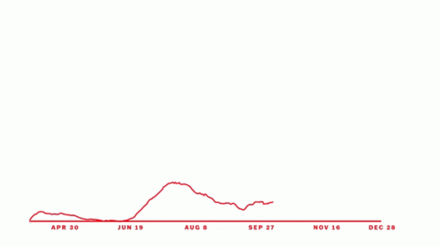

class: center

```{r, out.width='40%', echo=FALSE}

```
# Sknifedatar

**Ajuste y visualización de múltiples modelos**

**sobre múltiples series de tiempo**

<br>
<br>
<br>
2021-06-24

Rafael Zambrano & Karina Bartolomé
<br>

---
```{r setup, include=FALSE}
knitr::opts_chunk$set(warning = FALSE, 
                      message = FALSE, 
                      comment=FALSE)
```

```{r xaringan-themer, include=FALSE, warning=FALSE, eval=FALSE}
# Para generar el .css pero igual ya está generado, no correr de vuelta y editar el archivo directamente 
library(xaringanthemer)
style_mono_accent(
  title_slide_background_color	='#ffffff',
  title_slide_text_color = '#33407d',
  base_color = "#33407d",
  header_font_google = google_font("Josefin Sans"),
  text_font_google   = google_font("Montserrat", "300", "300i"),
  code_font_google   = google_font("Fira Mono")
)
```

```{css, echo=FALSE}
/* Table width = 100% max-width */
.remark-slide table{width: 100%;}
/* Change the background color to white for shaded rows (even rows) */
.remark-slide thead, .remark-slide tr:nth-child(2n) {
  background-color: white;
  .tfoot .td {background-color: white}
}
.bold-last-item > ul > li:last-of-type,
.bold-last-item > ol > li:last-of-type {font-weight: bold;}
```


```{r, include=FALSE, warning=FALSE}
xaringanExtra::use_progress_bar(color = "#0051BA", location = "top")
```

# ¿Quiénes somos?
.pull-left[
### Rafael Zambrano
- Actuario 🇻🇪
- Data Scientist en Ualá 🚀 
- Magister en métodos cuantitativos (en curso)
]
.pull-right[
<br>
<br>
```{r, out.width='35%', fig.align='center', echo=FALSE}

```
]

.pull-left[
### Karina Bartolomé
- Economista 🇦🇷 
- Data Scientist en Ualá 🚀 
- Especialista en métodos cuantitativos (en curso)
]
.pull-right[
<br>
<br>
```{r, out.width='35%', fig.align='center', echo=FALSE}

```
]
---
# ¿Qué es #modeltime?

Es un ecosistema desarrollado por **Matt Dancho** para realizar análisis de series de tiempo mediante un enfoque ordenado (o Tidy) con #tidymodels 📦. 

```{r, echo=FALSE, out.height='90%',out.width='90%',  fig.align='center'}
knitr::include_graphics('images/modeltime.png')
```

---

# Sknifedatar 
#### Una extensión de **#modeltime**
```{r, eval=FALSE}
install.packages('sknifedatar')
```
--
```{r, echo=FALSE, out.width='20%', out.height='20%', fig.align='center'}
knitr::include_graphics('images/sknifedatar.png')
```

Incluye: 
- **Funciones multifit**: Múltiples modelos en múltiples series de tiempo (sin datos de panel)
- **Workflowsets**: Ajuste de múltiples modelos y recetas de preprocesamiento con modeltime
- **Workflowset multifit**: Ajuste de múltiples modelos y recetas de preprocesamiento sobre múltiples modelos (sin datos de panel)
- **Automagic tabs**: Generación automática de tabs
---
# ¿Qué vamos a ver hoy?

```{r, echo=FALSE, out.width='30%', fig.align='center'}

```

- **Introducción a modeltime**

- **Multifit**: Ajuste de múltiples modelos en múltiples series de tiempo

- **Workflowsets**: Ajuste de múltiples modelos y recetas de preprocesamiento sobre múltiples modelos

- **Automagic tabs**: Generación automática de tabs en Distill / Rmd

---

# Librerías utilizadas 📚 

```{r, message=FALSE}
library(sknifedatar)
library(modeltime)
library(workflowsets)
library(tidymodels)
library(tidyverse)
library(timetk)
library(anomalize) 
library(lubridate)
```

```{r, echo=FALSE}
library(gt)
```


```{r, echo=FALSE, out.width='50%', fig.align='center'}

```

```{r, echo=FALSE}
xaringanExtra::use_panelset()
```

---

# Datos 📊 


--
```{r}
data <- read_rds('data/series_data.rds')
```
--
```{r, echo=FALSE}
data %>% head(5) %>% kableExtra::kable(format = "html")
```

---

### Evolución 📈 

```{r, fig.width=10, fig.height=5, message=FALSE, eval=FALSE}
data %>% group_by(dept_id) %>%
  plot_time_series(date, value) 
```

```{r, fig.width=10, fig.height=6, message=FALSE, echo=FALSE}
data %>% group_by(dept_id) %>%
  plot_time_series(date, value, .interactive=FALSE,
    .facet_ncol = 2, .facet_scales = 'free_y') 
```

---
### Detección de anomalías 🔍 

```{r, fig.width=10, fig.height=5, message=FALSE, eval=FALSE}
data %>% group_by(dept_id) %>%
  plot_anomaly_diagnostics(date, value) 
```

```{r, fig.width=10, fig.height=6, message=FALSE, echo=FALSE}
data %>% group_by(dept_id) %>%
  plot_anomaly_diagnostics(date, value, .anom_size = 2, .interactive=FALSE,
    .facet_ncol = 2, .max_anomalies = 0.05, .facet_scales = 'free_y', .line_size=0.1) 
```

---

### Limpieza de anomalías

```{r}
data_cleaned <- data %>%
  
  group_by(dept_id) %>% 
  
  # 1. Decompose and anomalize the STL decomposition remainder
  time_decompose(value) %>%
  
  # 2. Fix negative values if any in observed
  mutate(observed = ifelse(observed < 0, 0, observed)) %>%
  
  # 3. Identify anomalies
  anomalize(remainder) %>%
  
  # 4. Clean & repair anomalous data
  clean_anomalies() %>% 
  
  ungroup() 
```

```{r, echo=FALSE}
data_cleaned %>% 
  filter(anomaly == "Yes", dept_id=='FOODS_3') %>%
  select(dept_id, date, anomaly, observed, observed_cleaned) %>%
  gt()
```


---

```{r}
data_cleaned <- data_cleaned %>% select(dept_id, date, value = observed_cleaned)
```


Graficando nuevamente las series, se observa que ya no se mantienen observaciones atípicas:


```{r, fig.width=10, fig.height=6, message=FALSE, echo=FALSE}
data_cleaned %>% group_by(dept_id) %>%
  plot_time_series(date, value, .interactive=FALSE,
    .facet_ncol = 2, .facet_scales = 'free_y', .line_size=0.5) 
```


---


### Descomposición de series de tiempo 

.panelset[
.panel[.panel-name[FOODS_2]

```{r, message=FALSE, echo=FALSE, fig.width=10, fig.height=6}
nest_data <- data_cleaned %>% nest(nested_column = -dept_id)
nest_plots <- nest_data %>%
  mutate(ts_plots = map(nested_column, 
          ~  plot_stl_diagnostics(.x, 
              .date_var=date, 
              .value=value, 
              .frequency = 'auto',
              .trend = 'auto', 
              .interactive=FALSE,
              .feature_set = c("observed", "season", "trend", "remainder"))
          ))
nest_plots$ts_plots[[1]]
```
]

.panel[.panel-name[FOODS_3]

```{r, echo=FALSE, fig.width=10, fig.height=6}
nest_plots$ts_plots[[2]]
```
]

.panel[.panel-name[HOBBIES_2]

```{r, echo=FALSE, fig.width=10, fig.height=6}
nest_plots$ts_plots[[3]]
```
]

.panel[.panel-name[HOUSEHOLD_1]

```{r, echo=FALSE, fig.width=10, fig.height=6}
nest_plots$ts_plots[[4]]
```
]
]
---
### Descomposición de series de tiempo: último año

.panelset[
.panel[.panel-name[FOODS_2]

```{r, message=FALSE, echo=FALSE, fig.width=10, fig.height=6}
nest_data <- data_cleaned %>% 
  filter(date>as.Date('2016-01-01')) %>% 
  nest(nested_column = -dept_id)
nest_plots <- nest_data %>%
  mutate(ts_plots = map(nested_column, 
          ~  plot_stl_diagnostics(.x, 
              .date_var=date, 
              .value=value, 
              .frequency = 'auto',
              .trend = 'auto', 
              .interactive=FALSE,
              .feature_set = c("observed", "season", "trend", "remainder"))
          ))
nest_plots$ts_plots[[1]]
```
]

.panel[.panel-name[FOODS_3]

```{r, echo=FALSE, fig.width=10, fig.height=6}
nest_plots$ts_plots[[2]]
```
]

.panel[.panel-name[HOBBIES_2]

```{r, echo=FALSE, fig.width=10, fig.height=6}
nest_plots$ts_plots[[3]]
```
]

.panel[.panel-name[HOUSEHOLD_1]

```{r, echo=FALSE, fig.width=10, fig.height=6}
nest_plots$ts_plots[[4]]
```
]
]

---

<br>
<br>
# Múltiples modelos y una serie 
<br>
```{r, out.width='25%', fig.align='center', echo=FALSE}
knitr::include_graphics('images/gif_gatos_multi.gif')
```


---
## Flujo de trabajo de modeltime 

### Preparación de datos ⚙️

* Se selecciona el departamento 🏖 **FOODS_3** 

```{r, fig.height=3, fig.width=10}
data_foods3 <- data_cleaned %>% 
  filter(dept_id=='FOODS_3') %>% 
  select(-dept_id)
```

--
* Particiona el dataset en train y test ✂️

```{r, fig.height=3, fig.width=10}
splits <- data_foods3 %>%  
  initial_time_split(prop = 0.85)
```

---
### Visualización de la partición 

```{r, fig.height=6, fig.width=10}
splits %>% 
  tk_time_series_cv_plan() %>%
  plot_time_series_cv_plan(date, value) 
```

---
### Receta 🌮 
Se crea una receta de **preprocesamiento**, incluye la fórmula a estimar y un paso adicional que añade variables en función de la fecha.
```{r}
receta <- recipe(value ~ date, data = training(splits)) %>%
  
  step_timeseries_signature(date) %>% 
  
  step_rm(contains("iso"), 
          contains("minute"), 
          contains("hour"),
          contains("am.pm"), 
          contains("xts"), 
          contains("second"),
          date_index.num, 
          date_wday.lbl, 
          date_month.lbl)
```

```{r, echo=FALSE}
receta %>% prep() %>% juice() %>% head(2) %>% gt()
```

---
### Modelos 🚀 
Definición y ajuste de modelos sobre train

```{r, eval=FALSE}
# Modelo: Auto-ARIMA
m_autoarima <- arima_reg() %>% 
  set_engine('auto_arima') %>%  
  fit(value~date, data=training(splits))

# Modelo: exponential smoothing
m_exp_smoothing <- exp_smoothing() %>% 
  set_engine('ets') %>% 
  fit(value~date, data=training(splits))

# Modelo: regresión lineal
m_reg_lineal <- linear_reg() %>%
  set_engine("lm") %>%
  fit(value ~ as.numeric(date) + 
                         factor(month(date, label = TRUE), ordered = FALSE)+
                         factor(wday(date, label=TRUE), ordered=FALSE),
      data = training(splits))

# Workflow: prophet boosted
m_prophet_boost <- workflow() %>% 
  add_recipe(receta) %>% 
  add_model(
    prophet_boost(mode='regression') %>%
    set_engine("prophet_xgboost")
  ) %>% 
  
  fit(data = training(splits))
```

---
### Modeltimetable 

El objeto central del ecosistema #modeltime 📦 es el **modeltime_table**, el cual incluye todos los modelos entrenados para realizar comparaciones. 

```{r, eval=FALSE}
modelos <- modeltime_table(m_autoarima,
                           m_exp_smoothing,
                           m_reg_lineal,
                           m_prophet_boost
                           )
```

```{r, echo=FALSE}
#saveRDS(modelos, 'modelos/modelos_food3.rds')
modelos <- readRDS('modelos/modelos_food3.rds')
```

--
```{r, echo=FALSE}
modelos %>% rmarkdown::paged_table(list(rows.print = 6))
```

---
### Calibración de modelos 🔧 
Se verifica el **rendimiento** de los modelos sobre la partición de test.

```{r}
calibration_table  <- modelos %>% 
  modeltime_calibrate(new_data = testing(splits))
```

--
* Verificación de métricas 🎯 
```{r, eval=FALSE}
calibration_table %>% 
  modeltime_accuracy()
```

```{r, echo=FALSE}
calibration_table %>% modeltime_accuracy() %>% 
  select(-.type) %>% 
  rmarkdown::paged_table(list(rows.print = 6))
```

---
* Forecasting 🔬 

Se realiza la **proyección** sobre los datos de testing para luego visualizarla. 

```{r}
forecast_series <- calibration_table %>% 
  modeltime_forecast(
    new_data    = testing(splits),
    actual_data = data_foods3)
```

---

### Verificación visual

```{r, fig.height=5, fig.width=10}
forecast_series %>% 
  plot_modeltime_forecast(
    .legend_max_width     = 30, 
    .interactive          = FALSE,
    .conf_interval_alpha  = 0.2
  )
```

---
### Selección y reajuste de modelos

Se seleccionan 2 modelos y luego se reajustan ambos modelos en todos los datos (train + test)

```{r}
refit_tbl <- calibration_table %>%
  filter(.model_id %in% c(2,4)) %>% 
  modeltime_refit(data = data_foods3)
```

---

## Proyección 🔮 

```{r}
forecast_final <- refit_tbl %>% 
  modeltime_forecast(
    actual_data = data_foods3 %>% as.data.frame(),
    h='6 months'
  )
```

---

### Visualización de la proyección a 2 años
```{r, fig.height=5, fig.width=10}
forecast_final %>% 
  plot_modeltime_forecast(
    .legend_max_width = 30, 
    .interactive      = FALSE,
    .conf_interval_alpha = 0.2
)
```

---